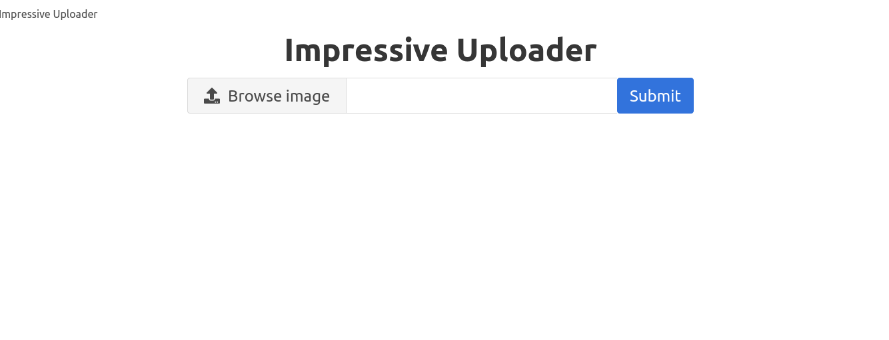
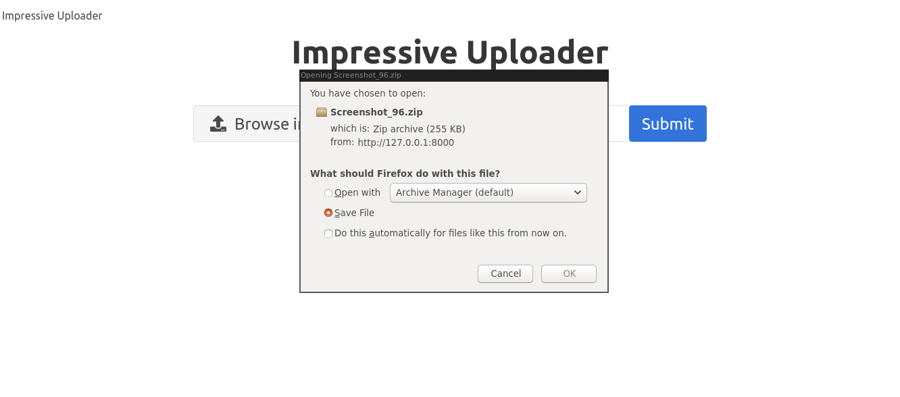

[](https://github.com/nightwarriorftw/impressive_uploader/issues) [](https://github.com/nightwarriorftw/impressive_uploader/network/members) [](https://github.com/nightwarriorftw/impressive_uploader/stargazers)    [](https://twitter.com/intent/follow?screen_name=nightwarriorftw) [](https://telegram.me/nightwarriorftw)

# Impressive Uploader

## About

In this project we will be doing heavy async tasks in the background (like generating thumbnail images) using **Celery**, **Redis** and **Django**. This is just a demo how we can handle heavy intensive task at Backend.

## :wrench: Development

#### Create virtual environment and activate

```
python3 -m venv virtual
source ./virtual/bin/activate
```

#### Clone the repo and install requirements.txt

```
git clone https://github.com/nightwarriorftw/impressive_uploader.git
cd impressive_uploader
pip install -r requirements.txt
```

#### Setup Celery and Redis

- Open 2 terminals and run the following commands respectively in them

```
celery -A creator worker -l info
```

```
redis-server
```

#### Makemgirations and run the server

```
python manage.py makemigrations
python manage.py migrate
python manage.py runserver
```

## :camera: Gallery

- front page



- upload image


- Wait till the image is processing


- Download the result



_Spoiler Alert_ - Something cool is coming
